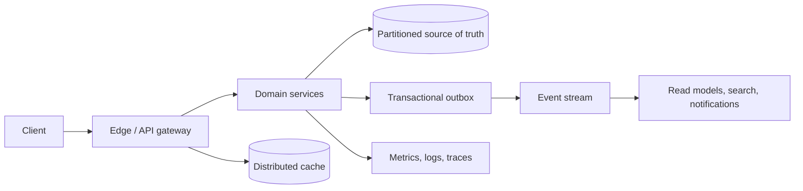
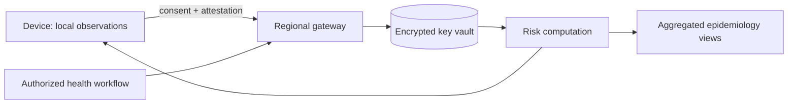

# IDS-002 · Design Aarogya Setu

## Contents

1. [Interview framing and scope](#interview-framing-and-scope)
2. [Requirements and assumptions](#requirements-and-assumptions)
3. [Architecture](#architecture)
4. [Data and APIs](#data-and-apis)
5. [Correctness and distributed operation](#correctness-and-distributed-operation)
6. [Reliability, security, and operations](#reliability-security-and-operations)
7. [Scale and evolution](#scale-and-evolution)
8. [Trade-offs and follow-ups](#trade-offs-and-follow-ups)

> **Interview note:** These are interview designs, not claims about any proprietary implementation. State the assumptions aloud and challenge them when the interviewer changes the product, traffic, or regulatory constraints.

## Interview framing and scope

Start by naming the actors, the primary user journey, and the boundary of the first release. Separate the source of truth from derived views, and agree which guarantees users actually need. Keep the first diagram small; add partitions, queues, caches, and regional controls only when a requirement motivates them.

## Requirements and assumptions

| Dimension | Baseline assumption | Design consequence |
| --- | --- | --- |
| Availability | 99.95% for the core user journey | Multi-AZ stateless services and tested failover |
| Latency | p95 under 250 ms for interactive reads; p99 under 1 s | Cache hot paths and bound fan-out |
| Durability | No acknowledged write is lost | Quorum/transactional persistence and replayable events |
| Growth | 3x traffic and 2x data in 24 months | Partition keys, online migration, and backpressure |

Functional requirements, exclusions, and scale numbers below are deliberately explicit. They are starting points, not facts; ask the interviewer to change one and recalculate capacity.

## Architecture

The control plane owns identity, policy, configuration, and lifecycle; the data plane serves the high-volume user path. APIs are stateless behind an edge gateway. Durable writes go to a partitioned primary store, then to an outbox/event stream. Consumers build search, cache, notification, analytics, and audit projections. Every asynchronous boundary has a stable event ID, a retry policy, and a dead-letter path.



### Component responsibilities

- **Edge:** TLS termination, authentication, request IDs, quota enforcement, schema validation, and coarse routing; no business transactions.
- **Domain services:** Validate commands, enforce invariants, own their tables, and expose versioned contracts.
- **Source of truth:** Stores authoritative state with constraints and a recovery point objective compatible with the SLO.
- **Event pipeline:** Publishes committed facts, supports replay, preserves ordering only within a declared key, and isolates slow consumers.
- **Projection workers:** Materialize query-specific views; consumers are idempotent and record the last applied version.
- **Operations plane:** Provides feature flags, key rotation, audit trails, dashboards, and safe administrative repair tools.

## Data and APIs

### Critical contracts

Use opaque IDs, cursor pagination, explicit version fields, and idempotency keys on commands. Return a stable error envelope (`code`, `message`, `retryable`, `request_id`). A mutating request is accepted only after its command is durably recorded; clients can safely retry the same idempotency key.

```http
POST /v1/resources
Idempotency-Key: 01J...
If-Match: "version-7"

{ " ...": "domain fields" }

HTTP/1.1 202 Accepted
{ "resource_id": "r_123", "operation_id": "op_456", "state": "accepted" }
```

### Data model and indexes

Keep immutable identity and mutable state separate where auditability matters. Typical tables are `entities(id, tenant_id, state, version, created_at, updated_at)`, `commands(idempotency_key, actor_id, request_hash, result, created_at)`, and an append-only `events(event_id, aggregate_id, aggregate_version, type, payload, committed_at)`. Index by the access path (`tenant_id, updated_at, id`), enforce uniqueness at the database, and use TTL only for derived or explicitly expirable data.

## Correctness and distributed operation

### Key invariants

1. A committed command has one authoritative outcome, even if the client retries.
2. State transitions are validated against the current version; stale updates fail or merge explicitly.
3. A published event corresponds to a committed source-of-truth change (transactional outbox).
4. Derived views may lag, but expose a version/timestamp so clients can reason about staleness.
5. Reconciliation can detect and repair divergence without silently inventing business state.

### Read/write flows

**Write:** authenticate -> validate policy and idempotency key -> transactionally update the aggregate and outbox -> acknowledge -> asynchronously update projections. **Read:** authorize -> check a versioned cache -> query the appropriate projection/source -> attach freshness metadata -> emit latency and correctness telemetry. Use bounded retries with jitter only for transient failures; never retry a non-idempotent command without its key.

### Partitioning and replication

Partition by the dominant locality key (tenant, user, geography, or aggregate) and add a hot-key strategy for celebrity objects or global counters. Replicate synchronously across availability zones for acknowledged writes and asynchronously to a secondary region. Promote only after fencing the old writer; rebuild projections from the event log after failover. Cross-partition transactions should be avoided or implemented as a saga with compensating actions.

## Reliability, security, and operations

### Failure modes and recovery

- **Dependency timeout:** deadlines, circuit breakers, cached/stale reads, and a clear degraded response.
- **Duplicate delivery:** event IDs and consumer inbox tables make handlers idempotent.
- **Poison event:** exponential backoff, bounded attempts, dead-letter queue, and operator replay after correction.
- **Partition or region loss:** route to the healthy region, preserve a write fence, and reconcile when the partition heals.
- **Corrupt projection:** stop the consumer, snapshot the source, replay from a known offset, and compare checksums.

### Security, privacy, and abuse controls

Use least-privilege service identities, envelope encryption, key rotation, mTLS internally, and immutable audit records for sensitive operations. Classify fields, minimize collection, redact secrets and personal data from logs, and define retention/deletion workflows. Apply per-identity and per-network rate limits, payload limits, abuse scoring, anomaly detection, and admin approval for high-impact operations.

### Observability and SLOs

Track request rate, p50/p95/p99 latency, error budget burn, saturation, queue age, consumer lag, cache hit ratio, replication lag, stale-read age, and reconciliation drift. Propagate a trace ID through synchronous and asynchronous work. Page on user-visible symptoms and budget burn, not on every transient dependency error; attach runbooks and a tested rollback to each alert.

## Scale and evolution

### Capacity sketch

For 10 million daily active users and 20 requests per user per day, average traffic is about 2,300 requests/second. A 10x peak gives 23,000 requests/second. If a write is 2 KB and 5% of requests write, primary ingress is roughly 2.3 MB/s before replication; three replicas and indexes make the real storage budget several times larger. Size queues for peak bursts, not averages, and retain enough history for replay and compliance.

Scale stateless tiers horizontally, split read models by query shape, and isolate hot tenants. Use online repartitioning (dual-write, backfill, verify, cut over), schema compatibility windows, and feature flags. Keep an explicit cost model: cache memory, stream partitions, replicas, egress, and operational toil are part of the design.

## Trade-offs and follow-ups

- Strong synchronous cross-region writes improve RPO but increase tail latency and reduce availability during inter-region faults; single-writer plus asynchronous replication is often a better default.
- A relational source of truth gives constraints and transactions; a key-value store may win on predictable scale but shifts invariants into application code.
- Materialized views make reads fast and flexible but introduce lag and replay complexity.
- Build versus buy should include migration, operability, compliance, and lock-in—not just infrastructure price.

### Interviewer follow-up questions and strong-answer cues

1. **What changes at 100x traffic?** Identify the first bottleneck, shard key, hot-key mitigation, and which guarantees can be relaxed.
2. **What if the event stream is unavailable?** Keep the command path safe with an outbox, bound backlog, and define when to reject writes.
3. **How do you prove no duplicate charge/action?** Name the idempotency key, unique constraint, transaction boundary, and reconciliation job.
4. **How do you migrate without downtime?** Explain compatible schema, backfill checkpoints, dual reads/writes, validation, and rollback.
5. **What would you measure first in production?** Pick one user SLO, one saturation signal, one correctness invariant, and one cost metric.


## System-specific deep dive
## System-specific deep dive

### Scope and public-health framing

Design an interview-grade, consent-driven exposure-notification and public-health information platform. Do not claim this is the implementation of any real application. The scope is voluntary enrollment, privacy-preserving proximity observations, verified diagnosis/recovery workflows, risk computation, public-health dashboards, and regional resilience. Do not collect continuous GPS by default; a user can revoke consent and request deletion subject to narrowly documented legal retention.

Assume 300 million registered devices, 80 million daily active devices, 20 million rotating proximity observations per minute at peak, 2 million daily risk evaluations, and 99.99% availability for emergency information. Separate the public app from a tightly controlled epidemiology control plane operated by authorized health agencies.

### Privacy-first architecture

The device generates rotating ephemeral identifiers from a local daily key; observations remain encrypted on-device until a user explicitly consents to upload after a verified test. A regional gateway validates attestation and consent, then stores pseudonymous diagnosis keys in a residency-pinned vault. A distributed risk engine downloads compact keys or computes matches locally, returning risk bands and guidance—not identities or exact encounter locations. Public dashboards use aggregated, k-anonymous counts with suppression for small cells.



### Consent, data model, and workflows

Model `consents(subject, purpose, version, granted_at, revoked_at)`, `ephemeral_keys(key_id, region, expiry, status)`, `verified_cases(case_id, verification_source, diagnosis_window)`, and `risk_assessments(subject_token, algorithm_version, band, generated_at, expires_at)`. Store no name beside encounter tokens; keep the re-identification mapping in a separate HSM-backed system with dual-control access. Every case upload requires a one-time authorization token and a verified source; repeated submissions are idempotent.

The diagnosis flow is: clinician verifies -> agency issues authorization -> user reviews purpose and retention -> device uploads minimum keys -> validation and abuse checks -> regional publication -> clients compute risk -> user receives risk and guidance. Revocation stops future processing and triggers deletion/tombstoning in vaults and projections. Epidemiologists receive only approved aggregate dimensions and an auditable query log.

### Regional resilience and threat model

Pin raw health data to the legally appropriate region; replicate encrypted aggregates, not identifiable raw records, across regions. During a regional outage, show cached safety guidance and queue voluntary uploads locally; never silently route sensitive data to another jurisdiction. Threats include device compromise, stalking via token correlation, fake diagnoses, insider access, and inference from sparse dashboards. Mitigate with rotating IDs, short TTLs, rate limits, signed agency credentials, differential privacy/noise where suitable, access reviews, key rotation, penetration testing, and independent privacy audits.

### SLOs and follow-ups

Measure consent success, verification latency, risk publication freshness, false-positive/negative evaluation, regional queue age, key leakage attempts, and deletion completion time. A strong answer explains the epidemiological trade-off between longer retention and privacy, how algorithm versions are reproducible, what happens when a user lacks a smartphone, and how to suspend a compromised health-authority credential.
